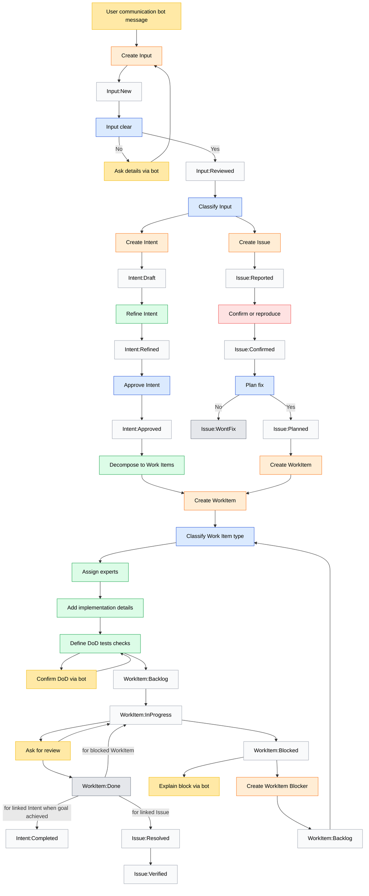

# Task Management - Abstract

This section defines the task management system used across the project. It is vendor-agnostic and describes the conceptual model.

## Task Types (exactly 4)

| Type          | Meaning              | Core Question               |
|---------------|----------------------|-----------------------------|
| **Input**     | Raw incoming signal  | What came to us?            |
| **Intent**    | Desired change       | What do we want to change?  |
| **Issue**     | Problem / deviation  | What is broken or risky?    |
| **Work Item** | Executable unit      | What exactly are we doing?  |

There are no other task types. "Blocker" is a role of a Work Item, not a type.

---

## States by Task Type

### Input States

| State            | Description              | Terminal |
|------------------|--------------------------|----------|
| `Input:New`      | Unprocessed signal       | No       |
| `Input:Reviewed` | Ready for classification | No       |
| → Intent         | Converted to Intent      | Yes      |
| → Issue          | Converted to Issue       | Yes      |

### Intent States

| State              | Description                  | Terminal |
|--------------------|------------------------------|----------|
| `Intent:Draft`     | Initial capture              | No       |
| `Intent:Refined`   | Requirements clarified       | No       |
| `Intent:Approved`  | Ready for decomposition      | No       |
| `Intent:Completed` | Goal satisfied by Work Items | Yes      |

### Issue States

| State             | Description                | Terminal |
|-------------------|----------------------------|----------|
| `Issue:Reported`  | Problem identified         | No       |
| `Issue:Confirmed` | Reproduced / validated     | No       |
| `Issue:Planned`   | Fix Work Item created      | No       |
| `Issue:Resolved`  | Fix Work Item done         | No       |
| `Issue:Verified`  | Post-fix validation passed | Yes      |
| `Issue:WontFix`   | Decided not to fix         | Yes      |

### Work Item States

| State                 | Description        | Terminal |
|-----------------------|--------------------|----------|
| `WorkItem:Backlog`    | Ready to start     | No       |
| `WorkItem:InProgress` | Being executed     | No       |
| `WorkItem:Blocked`    | Waiting on Blocker | No       |
| `WorkItem:Done`       | Completed          | Yes      |

---

## Creation Points (explicit)

| Action                         | Input                           | Output           | Trigger                 |
|--------------------------------|---------------------------------|------------------|-------------------------|
| **Create Input**               | Bot message, feedback, metric   | Input:New        | User communication      |
| **Create Intent**              | Reviewed Input                  | Intent:Draft     | Classification decision |
| **Create Issue**               | Reviewed Input                  | Issue:Reported   | Classification decision |
| **Create Work Item**           | Approved Intent or Planned Issue| WorkItem:Backlog | Decomposition           |
| **Create Work Item (Blocker)** | Blocked Work Item               | WorkItem:Backlog | Explicit block          |

Creation is not a status change — it introduces a new entity with its own lifecycle.

---

## Relationships (explicit and typed)

| From      | To        | Relationship          | Meaning                 |
|-----------|-----------|-----------------------|-------------------------|
| Input     | Intent    | `derived_from`        | Signal became intention |
| Input     | Issue     | `derived_from`        | Signal became problem   |
| Intent    | Work Item | `implemented_by`      | Intent realized by work |
| Issue     | Work Item | `fixed_by`            | Issue resolved by work  |
| Work Item | Work Item | `blocks` / `unblocks` | Dependency chain        |

---

## Blockers

A **Blocker** is a Work Item whose purpose is to unblock another Work Item.

**Rules:**
- A blocked Work Item never "waits silently"
- Blocking always produces a visible Blocker Work Item
- When the Blocker is `WorkItem:Done`:
  - The blocked Work Item transitions `Blocked → InProgress`

---

## Communication Model

Communication is **orthogonal** — it never changes state directly.

| Communication Step      | Purpose                      | May Inform            |
|-------------------------|------------------------------|-----------------------|
| Ask for clarification   | Gather details for Input     | Input review          |
| Confirm DoD             | Validate acceptance criteria | Work Item refinement  |
| Ask for review          | Request validation           | Work Item completion  |
| Explain block           | Document why work stopped    | Blocker creation      |

These steps feed information back into tasks but never create or transition state implicitly.

---

## Work Item Completion Effects

When a Work Item reaches `WorkItem:Done`:

| Condition                          | Effect                                    |
|------------------------------------|-------------------------------------------|
| Linked to Intent + goal achieved   | Intent → `Intent:Completed`               |
| Linked to Issue                    | Issue → `Issue:Resolved`                  |
| Is a Blocker for another Work Item | Blocked Work Item → `WorkItem:InProgress` |

---

## Operations Required

### Core Operations (all task types)

| Operation      | Description                                      |
|----------------|--------------------------------------------------|
| Create task    | Create a task ∈ {Input, Intent, Issue, WorkItem} |
| Read task      | Read a task by id                                |
| Update task    | Update task fields                               |
| Delete task    | Delete / cancel a task (where allowed by type)   |
| List tasks     | List tasks filtered by {type, status, relations} |
| Check task     | Check existence of a task                        |
| Change status  | Change task status, enforcing valid transitions  |

### Input Operations

| Operation        | Description                                          |
|------------------|------------------------------------------------------|
| Create Input     | Create Input                                         |
| Transition Input | Transition Input status ∈ {New → Reviewed → Dropped} |
| Classify Input   | Classify Input → {Intent, Issue}, creating target    |

### Intent Operations

| Operation          | Description                                                    |
|--------------------|----------------------------------------------------------------|
| Create Intent      | Create Intent (optionally derived from Input)                  |
| Update Intent      | Update Intent definition ∈ {outcome, value, success criteria}  |
| Transition Intent  | Transition status ∈ {Draft → Refined → Approved → Completed}   |
| Decompose Intent   | Decompose Intent → {WorkItem}*                                 |
| Query Intent items | Query WorkItems implementing Intent                            |
| Complete Intent    | Complete Intent when completion condition is met               |

### Issue Operations

| Operation         | Description                                                              |
|-------------------|--------------------------------------------------------------------------|
| Create Issue      | Create Issue (optionally derived from Input)                             |
| Update Issue      | Update Issue definition ∈ {expected, actual, severity}                   |
| Transition Issue  | Transition status ∈ {Reported → Confirmed → Planned → Resolved → Verified, WontFix} |
| Create fix        | Create WorkItem fixing Issue                                             |
| Query Issue items | Query WorkItems fixing Issue                                             |
| Resolve Issue     | Resolve Issue when fix WorkItem is Done                                  |
| Verify Issue      | Verify Issue                                                             |

### WorkItem Operations

| Operation           | Description                                                        |
|---------------------|--------------------------------------------------------------------|
| Create WorkItem     | Create WorkItem (from {Intent, Issue})                             |
| Update WorkItem     | Update definition ∈ {scope, exclusions, acceptance criteria, DoD}  |
| Transition WorkItem | Transition status ∈ {Backlog ↔ InProgress ↔ Blocked ↔ Done}        |
| Assign WorkItem     | Assign / reassign WorkItem                                         |
| Link to Intent      | Link WorkItem → Intent (implements)                                |
| Link to Issue       | Link WorkItem → Issue (fixes)                                      |

---

## Automation Invariants

These rules must **never** be violated:

1. Every task has a creation point
2. Every created task has a starting state and valid terminal state
3. No task changes state without an explicit transition
4. Communication never changes state implicitly
5. Work Item completion effects are explicit

---

## Workflow Diagram

