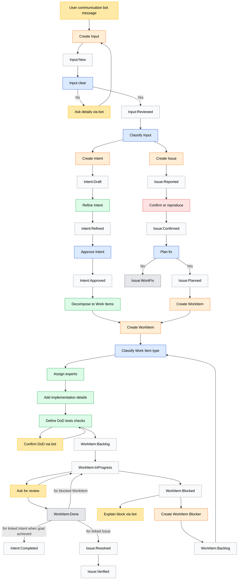

## Task Management

This project uses the **Task System** — work is organized by the maturity of a thought, with every transition explicit.

### Configuration

| Setting     | Value          |
|-------------|----------------|
| Project     | {project_key}  |
| Input Queue | {input_queue}  |
| Work Board  | {work_board}   |

### Task Types (exactly 4)

| Type          | Meaning              | Core Question               | Backend Mapping         |
|---------------|----------------------|-----------------------------|-------------------------|
| **Input**     | Raw incoming signal  | What came to us?            | {input_type_mapping}    |
| **Intent**    | Desired change       | What do we want to change?  | {intent_type_mapping}   |
| **Issue**     | Problem / deviation  | What is broken or risky?    | {issue_type_mapping}    |
| **Work Item** | Executable unit      | What exactly are we doing?  | {workitem_type_mapping} |

There are no other task types. "Blocker" is a role of a Work Item, not a type.

---

### States by Task Type

#### Input States

| State            | Description              | Terminal |
|------------------|--------------------------|----------|
| `Input:New`      | Unprocessed signal       | No       |
| `Input:Reviewed` | Ready for classification | No       |
| → Intent         | Converted to Intent      | Yes      |
| → Issue          | Converted to Issue       | Yes      |

#### Intent States

| State              | Description                  | Terminal |
|--------------------|------------------------------|----------|
| `Intent:Draft`     | Initial capture              | No       |
| `Intent:Refined`   | Requirements clarified       | No       |
| `Intent:Approved`  | Ready for decomposition      | No       |
| `Intent:Completed` | Goal satisfied by Work Items | Yes      |

#### Issue States

| State             | Description                | Terminal |
|-------------------|----------------------------|----------|
| `Issue:Reported`  | Problem identified         | No       |
| `Issue:Confirmed` | Reproduced / validated     | No       |
| `Issue:Planned`   | Fix Work Item created      | No       |
| `Issue:Resolved`  | Fix Work Item done         | No       |
| `Issue:Verified`  | Post-fix validation passed | Yes      |
| `Issue:WontFix`   | Decided not to fix         | Yes      |

#### Work Item States

| State                 | Description        | Terminal |
|-----------------------|--------------------|----------|
| `WorkItem:Backlog`    | Ready to start     | No       |
| `WorkItem:InProgress` | Being executed     | No       |
| `WorkItem:Blocked`    | Waiting on Blocker | No       |
| `WorkItem:Done`       | Completed          | Yes      |

---

### Creation Points (explicit)

| Action                         | Input                           | Output           | Trigger                 |
|--------------------------------|---------------------------------|------------------|-------------------------|
| **Create Input**               | Bot message, feedback, metric   | Input:New        | User communication      |
| **Create Intent**              | Reviewed Input                  | Intent:Draft     | Classification decision |
| **Create Issue**               | Reviewed Input                  | Issue:Reported   | Classification decision |
| **Create Work Item**           | Approved Intent or Planned Issue| WorkItem:Backlog | Decomposition           |
| **Create Work Item (Blocker)** | Blocked Work Item               | WorkItem:Backlog | Explicit block          |

Creation is not a status change — it introduces a new entity with its own lifecycle.

---

### Relationships (explicit and typed)

| From      | To        | Relationship          | Meaning                 |
|-----------|-----------|-----------------------|-------------------------|
| Input     | Intent    | `derived_from`        | Signal became intention |
| Input     | Issue     | `derived_from`        | Signal became problem   |
| Intent    | Work Item | `implemented_by`      | Intent realized by work |
| Issue     | Work Item | `fixed_by`            | Issue resolved by work  |
| Work Item | Work Item | `blocks` / `unblocks` | Dependency chain        |

---

### Blockers

A **Blocker** is a Work Item whose purpose is to unblock another Work Item.

**Rules:**
- A blocked Work Item never "waits silently"
- Blocking always produces a visible Blocker Work Item
- When the Blocker is `WorkItem:Done`:
  - The blocked Work Item transitions `Blocked → InProgress`

---

### Communication Model

Communication is **orthogonal** — it never changes state directly.

| Communication Step      | Purpose                      | May Inform            |
|-------------------------|------------------------------|-----------------------|
| Ask for clarification   | Gather details for Input     | Input review          |
| Confirm DoD             | Validate acceptance criteria | Work Item refinement  |
| Ask for review          | Request validation           | Work Item completion  |
| Explain block           | Document why work stopped    | Blocker creation      |

These steps feed information back into tasks but never create or transition state implicitly.

---

### Work Item Completion Effects

When a Work Item reaches `WorkItem:Done`:

| Condition                          | Effect                                    |
|------------------------------------|-------------------------------------------|
| Linked to Intent + goal achieved   | Intent → `Intent:Completed`               |
| Linked to Issue                    | Issue → `Issue:Resolved`                  |
| Is a Blocker for another Work Item | Blocked Work Item → `WorkItem:InProgress` |

---

### Backend Mapping: {task_backend}

| Minimal Task System | {task_backend} Equivalent   |
|---------------------|----------------------------|
| Input               | {backend_input_mapping}    |
| Intent              | {backend_intent_mapping}   |
| Issue               | {backend_issue_mapping}    |
| Work Item           | {backend_workitem_mapping} |
| Blocker             | {backend_blocker_mapping}  |

**State Mapping:**

```
{state_mapping_table}
```

---

### Available Operations

| Operation        | Description            | Command Example         |
|------------------|------------------------|-------------------------|
| Create Input     | Capture raw signal     | `{create_input_cmd}`    |
| Create Intent    | Define desired change  | `{create_intent_cmd}`   |
| Create Issue     | Report problem         | `{create_issue_cmd}`    |
| Create Work Item | Define executable work | `{create_workitem_cmd}` |
| Create Blocker   | Explicit dependency    | `{create_blocker_cmd}`  |
| Transition       | Move to next state     | `{transition_cmd}`      |
| Link             | Create relationship    | `{link_cmd}`            |
| Search           | Query tasks            | `{search_cmd}`          |

---

### Automation Invariants

These rules must **never** be violated:

1. Every task has a creation point
2. Every created task has a starting state and valid terminal state
3. No task changes state without an explicit transition
4. Communication never changes state implicitly
5. Work Item completion effects are explicit

---

### Workflow Diagram



---

### Usage Examples

```
"Create an input from the customer feedback about slow loading"
"Convert Input-123 to an Issue"
"Create a work item to fix Issue-456"
"What intents are waiting for approval?"
"Show all blocked work items"
"Create a blocker for WorkItem-789 - needs API access"
"Mark WorkItem-101 as done"
```

